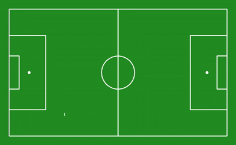

# ⚽ Football AI

This project visualizes football match data using a radar-style pitch overlay. It identifies and plots the ball, players, and referees on a football field using a color-coded layout. There can be chosen to have an option of ball tracking, which tracks the movement of the ball across the field with some consitent techniques used in the code.


<p align="center">
  
</p>


--

## 📦 Installation

Ensure Python 3.8+ is installed.

Install all dependencies using:


make sure to install supervision version 0.230 or higher while installing with the requirement file. everything should have been isntalled with supervision, still if you find some missing libraries install them on the go.

```bash
pip install -r requirements.txt
```


**VideoSource**:

```bash
!gdown -O "121364_0.mp4" "https://drive.google.com/uc?id=1vVwjW1dE1drIdd4ZSILfbCGPD4weoNiu"
```

## 📦 Use


```bash
python main.py --video_path '121364_0.mp4' --voronoi_blend true
```

 **--video_path**: Path for the source video of the game


 For different types of outfield results:
 
 **--voronoi_blend**: A Bool value if true returns Voronoi Blend output 
 
**--normal**: Bool value return the normal detection of players and teams

**--btrack**: bool value detects the radarview that tracks the ball path
 

 


## 📦 Results

Voronoi blend:


The results show the voronoi blend of the teams showing respective ball possession


<p align="center">
  
</p>


Ball Tracking:

The option shows the movement of the ball across the field. it represents the ball tracking part of the code.
<p align="center">
  
</p>


---

## 📄 License

This project is licensed under the [MIT License](LICENSE).


